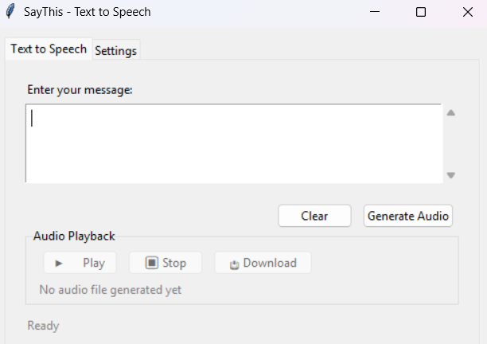

# SayThis
A simple Python GUI App that generates audio from text using TTS

## Setup

### Step 1: Download the Application

1. Go to the [Releases page](https://github.com/SociallyIneptWeeb/SayThis/releases) of this repository
2. Download the latest release ZIP file for your operating system:
   - **Windows**: `saythis-Windows.zip`
   - **macOS**: `saythis-macOS.zip`
   - **Linux**: `saythis-Linux.zip`

### Step 2: Extract and Run

1. Extract the downloaded ZIP file to a folder of your choice
2. Navigate into the extracted folder
3. Double-click on `SayThis.exe` to run the application

## Configure Your API Key

### Obtain ElevenLabs API Key

1. Navigate to https://elevenlabs.io/app/home and login/signup
2. Click on profile pic on bottom left and then click **API Keys**
3. Click **Create API Key** and enter a name
4. Copy the API key shown and save it in a file as this is the only time the key is viewable
5. If the API key is lost, simply follow the steps again to create a new one

### Add API Key to SayThis App

1. Open the SayThis application
2. Click on the **Settings** tab
3. Paste your copied ElevenLabs API Key into the API Key input field
4. Click the **Save Settings** button

You're now ready to use SayThis! Simply switch back to the TTS tab, enter your text and generate high-quality audio using ElevenLabs' text-to-speech API.
